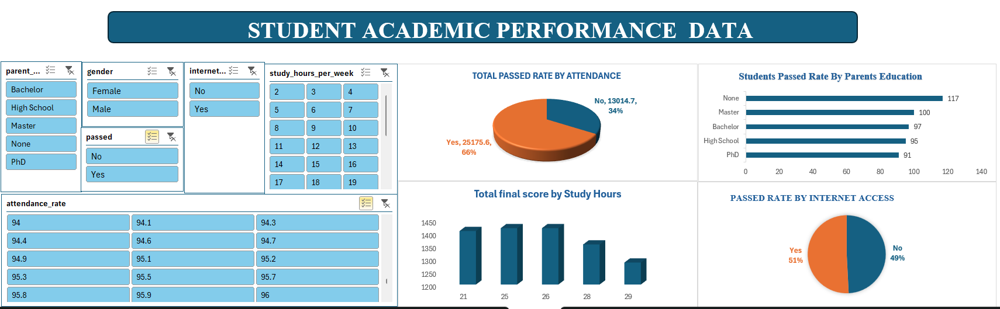

**Data Analysis Potfolio**

**Project 1**

**Title** [STUDENTS ACADEMIC PERFORMANCE RECORDS](https://github.com/Samsonk92/Samsonk92.github.io/blob/main/SAPRECORDS2.png) 

**Project Overview**

Analysed academic performance data of 500 high school students to identify the key drivers of student success.

Built interactive dashboards and performed data cleaning, transformation, and exploratory data analysis (EDA) using Excel and Power Query.

Investigated the impact of study habits, attendance, parental education, and internet access on student outcomes.

**Key Insights**

Attendance was the strongest predictor of academic success students with high attendance accounted for 66% of passes.

Optimal study time mattered more than excessive studying students studying 24–26 hours/week achieved the highest performance, while results declined beyond this range.

Parental education showed limited influence on student success, suggesting behavioural factors play a bigger role.

Internet access had minimal direct impact on pass rates, indicating that student engagement and study habits were more 
critical.

Identified that balanced study routines, consistent attendance, and student engagement were the major contributors to improved academic outcomes.

**Business/Stakeholder Recommendations**

Implement early attendance intervention systems to identify at-risk students.

Promote effective study techniques and balanced learning schedules.

Focus educational support on student behaviour and engagement rather than demographic assumptions.

Ensure learning resources remain accessible both online and offline.

**Impact**

Delivered actionable insights that can help schools improve student performance through data-driven decision-making.

Designed clear, interactive dashboards for easy monitoring of academic trends and student risk factors.

**Dash Board Overview**

**Project 2**

Project Overview
Analysed customer purchasing behaviour in the footwear industry using Power BI to identify how brand preference, shopping channels, product types, and regional trends influence sales performance and consumer decisions.

**Tools Used** Power BI, Power Query, DAX, Excel

**Data Cleaning & Preparation**

Cleaned and transformed raw sales data using Power Query and Excel.

Removed duplicates, handled missing values, and corrected inconsistent data entries.

Standardised country names, product categories, and sales channel formats for accurate analysis.

Converted data types and validated revenue calculations to improve reporting accuracy.

Created calculated measures and KPIs using DAX for Month-over-Month revenue analysis and performance tracking.

**Key Insights**

Skechers generated the highest revenue, indicating strong customer trust and brand loyalty.

Retail stores outperformed online sales, showing customers prefer physical shopping experiences for footwear purchases.

Sneakers and Formal shoes recorded the highest demand, suggesting customers prioritise comfort, fashion, and everyday usability.

UAE and UK were the top-performing markets, while Germany showed the lowest sales performance.

Month-over-Month analysis revealed strong sales growth in February and July, with a significant decline in August, highlighting seasonal buying behaviour.

**Business Recommendations**

Strengthen marketing around high-performing brands and products.

Improve in-store customer experience to increase customer retention and sales.

Expand digital marketing and online customer engagement strategies.

Use seasonal promotions and targeted campaigns to manage revenue fluctuations.

Focus growth strategies on high-performing regions while improving underperforming markets.

**Portfolio Impact**

Built an interactive Power BI dashboard to analyse customer psychology and purchasing behaviour.

Delivered actionable insights to support data-driven sales, marketing, and customer engagement strategies.

Applied data visualisation, KPI tracking, and trend analysis to improve business decision-making.

**Project 3** 

Healthcare Analytics Dashboard | Excel Business Intelligence Project
Project Overview

Developed an interactive Healthcare Analytics Dashboard in Excel to monitor patient metrics, treatment costs, hospital performance, admission trends, demographics, and insurance coverage. The dashboard transforms raw healthcare data into actionable insights that support operational and strategic decision-making for healthcare stakeholders.

**Tools & Skills Demonstrated**

Microsoft Excel, Interactive Dashboard Design, KPI Reporting, Data Cleaning & Transformation, Pivot Tables & Pivot Charts, Slicers & Dynamic Filtering, Business Intelligence, Healthcare Data Analytics, Data Visualization, Stakeholder Reporting

**Business Problems Addressed**

This dashboard helps healthcare stakeholders to:

Monitor total patient activity and treatment costs
Track yearly patient admission trends
Identify high-demand medical conditions
Analyze patient demographics and age distribution
Evaluate insurance provider coverage
Monitor physician workload and hospital performance
Support resource allocation and operational planning
Improve healthcare decision-making through data visualization

**Key Insights Delivered**

**Operational Insights**

Patient admissions remained stable between 2020–2023 before declining in 2024, highlighting the need for capacity and trend monitoring.
Average hospital stay of 16 days indicates significant resource utilization and operational pressure.

**Financial Insights**

Total treatment costs exceeded $1.4B, emphasizing the importance of cost optimization and healthcare efficiency.
Average treatment cost per patient provides visibility into healthcare spending patterns.

**Clinical Insights**

Chronic conditions such as Arthritis, Diabetes, and Hypertension recorded the highest patient volume.
Elderly patients (71+) represented the largest patient group, reinforcing the growing demand for geriatric and long-term care services.

**Stakeholder Insights**

Insurance coverage distribution was balanced across providers, reducing dependency risk.
Top-performing hospitals and doctors were identified for performance benchmarking and workload analysis.

**Stakeholder Recommendations**

**For Hospital Executives**

Invest in predictive analytics for patient demand forecasting.
Reduce treatment costs through operational efficiency initiatives.
Improve patient flow management to reduce length of stay.

**For Clinical Teams**

Strengthen chronic disease prevention and management programs.
Expand elderly care and long-term treatment support services.

**For Operations Managers**

Monitor declining admission trends in 2024 for strategic planning.
Optimize staffing and resource allocation using admission trends.

**For Financial Stakeholders**

Analyze high-cost treatment areas for budgeting and cost control.
Improve insurer relationship management and reimbursement tracking.

**Project Impact**

This project demonstrates the ability to transform complex healthcare datasets into clear, executive-level insights that support strategic planning, operational efficiency, and data-driven healthcare management.

**Dash Board Overview**
 

