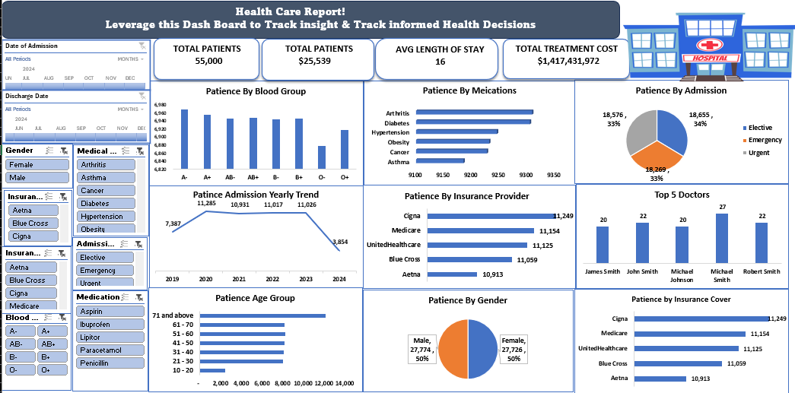
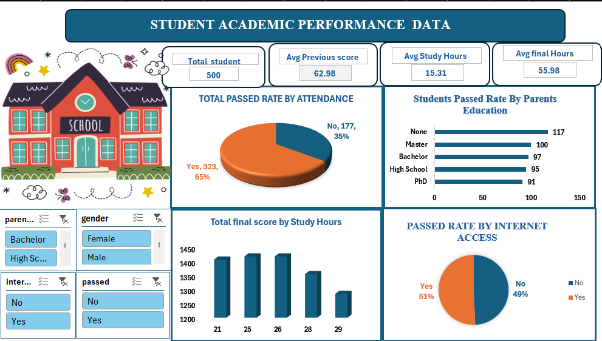

**Data Analysis Potfolio**

**Project 1** 

**Title** [Healthcare Analytics Dashboard](https://github.com/Samsonk92/Samsonk92.github.io/blob/main/HealthCareReports11.png)

Project Overview

Developed an interactive Healthcare Analytics Dashboard in Excel to monitor patient metrics, treatment costs, hospital performance, admission trends, demographics, and insurance coverage. The dashboard transforms raw healthcare data into actionable insights that support operational and strategic decision-making for healthcare stakeholders.

**Tools & Skills Demonstrated**

Microsoft Excel, Interactive Dashboard Design, KPI Reporting, Data Cleaning & Transformation, Pivot Tables & Pivot Charts, Slicers & Dynamic Filtering, Business Intelligence, Healthcare Data Analytics, Data Visualization, Stakeholder Reporting

**Business Problems Addressed**

This dashboard helps healthcare stakeholders to:

Monitor total patient activity and treatment costs
Track yearly patient admission trends
Identify high-demand medical conditions
Analyze patient demographics and age distribution
Evaluate insurance provider coverage
Monitor physician workload and hospital performance
Support resource allocation and operational planning
Improve healthcare decision-making through data visualization

**Key Insights Delivered**

**Operational Insights**

Patient admissions remained stable between 2020–2023 before declining in 2024, highlighting the need for capacity and trend monitoring.
Average hospital stay of 16 days indicates significant resource utilization and operational pressure.

**Financial Insights**

Total treatment costs exceeded $1.4B, emphasizing the importance of cost optimization and healthcare efficiency.
Average treatment cost per patient provides visibility into healthcare spending patterns.

**Clinical Insights**

Chronic conditions such as Arthritis, Diabetes, and Hypertension recorded the highest patient volume.
Elderly patients (71+) represented the largest patient group, reinforcing the growing demand for geriatric and long-term care services.

**Stakeholder Insights**

Insurance coverage distribution was balanced across providers, reducing dependency risk.
Top-performing hospitals and doctors were identified for performance benchmarking and workload analysis.

**Stakeholder Recommendations**

**For Hospital Executives**

Invest in predictive analytics for patient demand forecasting.
Reduce treatment costs through operational efficiency initiatives.
Improve patient flow management to reduce length of stay.

**For Clinical Teams**

Strengthen chronic disease prevention and management programs.
Expand elderly care and long-term treatment support services.

**For Operations Managers**

Monitor declining admission trends in 2024 for strategic planning.
Optimize staffing and resource allocation using admission trends.

**For Financial Stakeholders**

Analyze high-cost treatment areas for budgeting and cost control.
Improve insurer relationship management and reimbursement tracking.

**Project Impact**

This project demonstrates the ability to transform complex healthcare datasets into clear, executive-level insights that support strategic planning, operational efficiency, and data-driven healthcare management.

**Dash Board Overview**
 

**Project 2**

**Title** [HR Analytics Dash Board](https://github.com/Samsonk92/Samsonk92.github.io/blob/main/HRanalyticsdashboard.jpg) 

**Project Overview**
This project explores employee attrition patterns and workforce demographics through an interactive Power BI dashboard. By analyzing departmental turnover, salary bands, age groups, job roles, and employee experience, the dashboard reveals key factors influencing retention and workforce stability. The insights generated support strategic HR planning, talent management, and evidence-based decision-making, showcasing the power of analytics in driving organizational performance.

**Tools & Technologies Used**

Data Visualization & Business Intelligence
Power BI Desktop

**Data Preparation & Transformation**

Power Query Editor, Data Cleaning, Data Transformation, Data Profiling, Data Type Management, Data Modeling

**Data Analysis & Calculations**

DAX (Data Analysis Expressions), Custom Measures, Calculated Columns, Quick Measures, Time Intelligence Functions, Aggregation Functions

**Dashboard Development**

KPI Cards, Interactive Visualizations, Slicers and Filters, Drill-Down Analysis, Cross-Filtering, Conditional Formatting, Custom Tooltips.

**Skills Demonstrated**

Data Cleaning and Transformation, Data Modeling, DAX Measure Development, KPI Design, Interactive Dashboard Development, Workforce Analytics
Attrition Analysis, Data Visualization, Business Intelligence, Data Storytelling, Insight Generation, Stakeholder Reporting, Analytical Thinking
Problem Solving.

**Business Problems Addressed**
Monitoring employee attrition and workforce retention trends.
Identifying departments, job roles, and salary bands with the highest turnover.
Understanding workforce demographics and employee distribution.
Supporting data-driven HR and workforce planning decisions.
Evaluating the impact of compensation and experience on attrition.
Improving employee retention strategies through actionable insights.
Enabling executive-level workforce reporting and KPI tracking.
Transforming HR data into meaningful business intelligence for decision-making.

**Executive Summary**

The organisation currently employs 1,417 employees, with 1,186 active employees and 231 recorded attritions, resulting in an overall attrition rate of 16.3%.
While workforce demographics appear balanced in terms of age and gender distribution, attrition is concentrated within specific departments, salary bands, and job roles, indicating targeted retention challenges rather than organisation-wide dissatisfaction.

**Key Insights & Recommendations**

**1. Operations Department Has the Highest Attrition**

The Operations department represents the largest workforce segment (36% of employees) and experiences the highest employee turnover. This may indicate workload pressures, employee dissatisfaction, or limited career progression opportunities.

**Recommendation:** 

Conduct targeted employee engagement surveys, exit interviews, and workload assessments to identify root causes of attrition.

**2. Mid-Level Employees Are Most Likely to Leave**

Employees within the 6–10 LPA salary band show the highest attrition levels, suggesting retention challenges among experienced and high-performing talent.

**Recommendation:** 

Review compensation structures, career development pathways, and promotion opportunities to improve retention.

**3. Research-Focused Roles Face Retention Challenges**

Research Scientist positions contribute significantly to attrition, posing a risk to innovation, knowledge retention, and organizational growth.

**Recommendation:**

Strengthen professional development programs, internal mobility opportunities, and long-term career planning initiatives.

**4. Early-Career Employees Show Higher Turnover**

Attrition is concentrated among employees with lower years of experience, indicating potential onboarding and early engagement challenges.

**Recommendation:** 

Enhance onboarding programs, mentoring initiatives, and first-year employee support strategies.

**5. Workforce Is Concentrated Between Ages 26–45**

The majority of employees fall within the 26–45 age range, representing the organization's core productive workforce.

**Recommendation:** 

Prioritize retention and career development initiatives for this demographic to maintain workforce stability.

**Dash Board Overview**

**Project 3**

**Title** [STUDENTS ACADEMIC PERFORMANCE RECORDS](https://github.com/Samsonk92/Samsonk92.github.io/blob/main/StudentAcademic7.png)

**Project Overview**

Analysed academic performance data of 500 high school students to identify the key drivers of student success.

Built interactive dashboards and performed data cleaning, transformation, and exploratory data analysis (EDA) using Excel and Power Query.

Investigated the impact of study habits, attendance, parental education, and internet access on student outcomes.

**Key Insights**

Attendance was the strongest predictor of academic success students with high attendance accounted for 66% of passes.

Optimal study time mattered more than excessive studying students studying 24–26 hours/week achieved the highest performance, while results declined beyond this range.

Parental education showed limited influence on student success, suggesting behavioural factors play a bigger role.

Internet access had minimal direct impact on pass rates, indicating that student engagement and study habits were more 
critical.

Identified that balanced study routines, consistent attendance, and student engagement were the major contributors to improved academic outcomes.

**Business/Stakeholder Recommendations**

Implement early attendance intervention systems to identify at-risk students.

Promote effective study techniques and balanced learning schedules.

Focus educational support on student behaviour and engagement rather than demographic assumptions.

Ensure learning resources remain accessible both online and offline.

**Impact**

Delivered actionable insights that can help schools improve student performance through data-driven decision-making.

Designed clear, interactive dashboards for easy monitoring of academic trends and student risk factors.

**Dash Board Overview**

